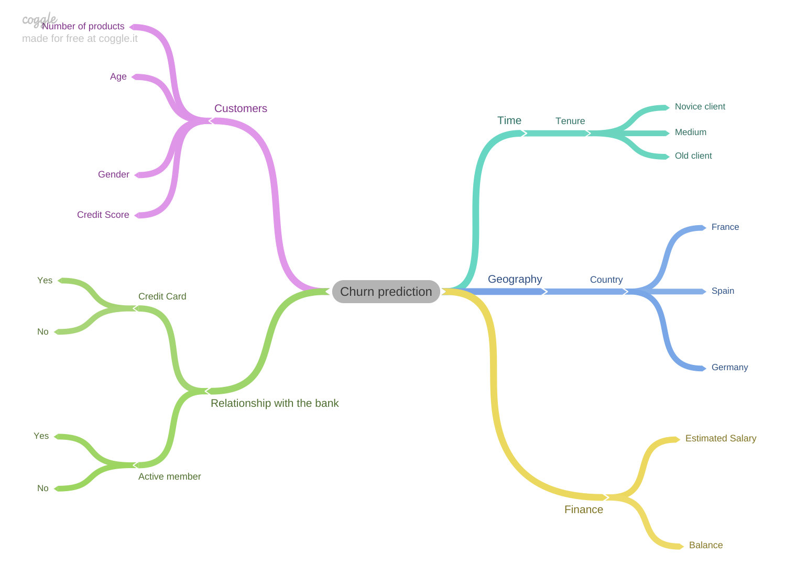
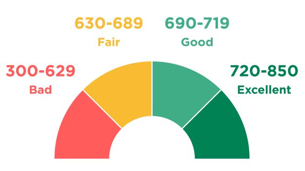
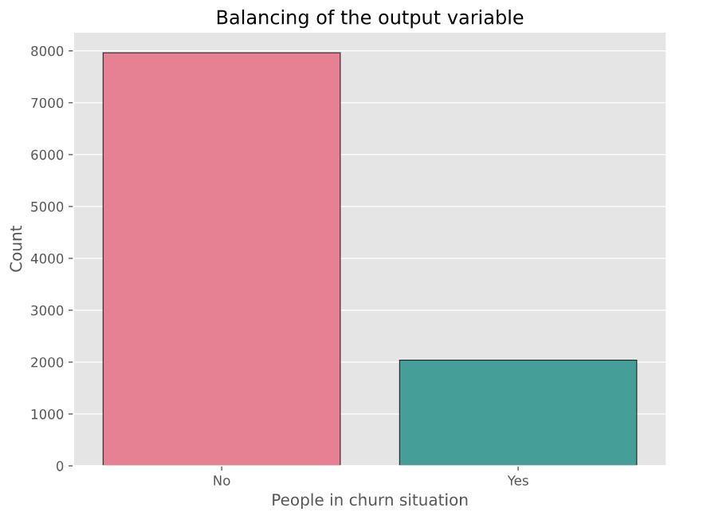
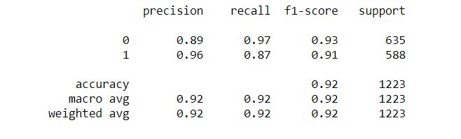
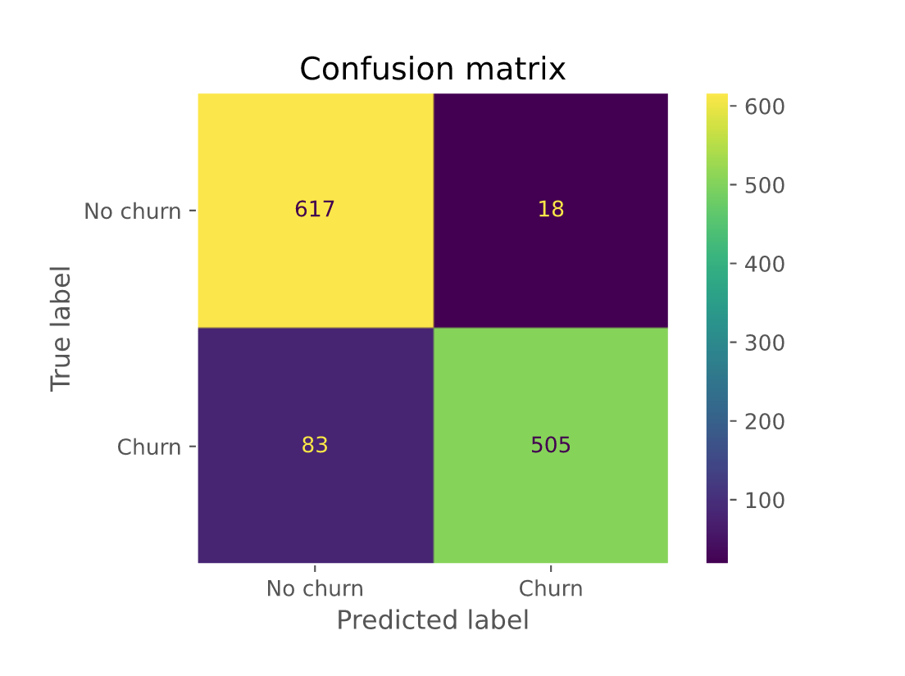
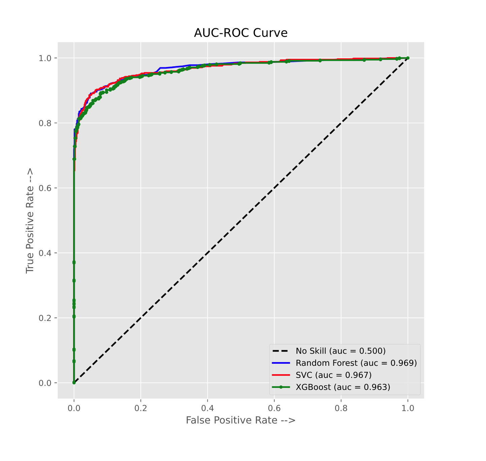

# <strong> Churn Prediction

<h1>Client Churn Prediction</h1>

Source: https://nextommerce.com/churn-rate-benchmarks/

 
 

# TopBottom bank
You were hired as a Data Science Consultant to create a high-performance model for identifying churn customers.
At the end of your consultancy, you need to deliver to the TopBottom bank CEO a model in production, which will receive a customer base via API and develop this base through scores, which means, one more column with the probability of each customer going into churn.

 

### What Is Churn Rate?

The churn rate, also known as the rate of attrition or customer churn, is the rate at which customers stop doing business with an entity. It is most commonly expressed as the percentage of service subscribers who discontinue their subscriptions within a given time period.

Source: https://www.investopedia.com/terms/c/churnrate.asp
___

 

Summary of variables:

| Feature                                       | Type                |                                       Feature Name                                          | Data Type                                        |
|:----------------------------------------------|:--------------------|:--------------------------------------------------------------------------------------------|:-------------------------------------------------|
| RowNumber                                     | Objective Feature   | number of the row                                                                           | int64                                            |
| CustomerId                                    | Objective Feature   | id of the customer                                                                          | int64                                            |
| Surname                                       | Objective Feature   | Last name of the customer                                                                   | object                                           |
| CreditScore                                   | Objective Feature   | The customer's Credit score for the consumer market                                         | int64                                            |
| Geography                                     | Objective Feature   | Country where the customer resides                                                          | object                                           |
| Gender                                        | Objective Feature   | The gender of the customer                                                                  | object                                           |
| Age                                           | Objective Feature   | Age of the customer                                                                         | object                                           |
| Tenure                                        | Objective Feature   | Number of months that the customer has remained active                                      | int64                                            |
| Balance                                       | Objective Feature   | The amount spent by the customer with the company TopBottom                                 | float64                                          |
| NumOfProducts                                 | Objective Feature   | The number of products purchased by the customer                                            | int64                                            |
| HasCrCard                                     | Objective Feature   | Flag indicating whether the customer has a credit card or not                               | binary                                           |
| IsActiveMember                                | Objective Feature   | Flag indicating whether the customer still has an active registration at TopBottom          | int64                                            |
| EstimatedSalary                               | Objective Feature   | Estimated monthly salary of the client                                                      | float64                                          |

 
 
 

## Mind Map

The hypothesis are created based on the mind map of the problem.

- **H1:** People with bad credit score are the most one in churn situation
- **H2:** Most of the customers are in a good credit score condition
- **H3:** The customers with the lowest salaries tend to be in a churn situation
- **H4:** The customers with fewer years of tenure tend to be in a churn situation
- **H5:** The quantity of the customers with balance less than 10 is very low
- **H6:** Most of the customers in churn situation are the youngest ones

 
 

___
It was observed the credit score has a great influence in churn situation

## Credit score range

## Credit score factors

1 - Payment history: Payment history is the most important ingredient in credit scoring, and even one missed payment can have a negative impact on your score. Lenders want to be sure that you will pay back your debt, and on time, when they are considering you for new credit. Payment history accounts for 35% of your FICO® Score☉ , the credit score used by most lenders.

2 - Credit utilization: Your credit utilization ratio is calculated by dividing the total revolving credit you are currently using by the total of all your revolving credit limits. This ratio looks at how much of your available credit you're utilizing and can give a snapshot of how reliant you are on non-cash funds. Using more than 30% of your available credit is a negative to creditors. Credit utilization accounts for 30% of your FICO® Score.

3 - Credit history length: How long you've held credit accounts makes up 15% of your FICO® Score. This includes the age of your oldest credit account, the age of your newest credit account and the average age of all your accounts. Generally, the longer your credit history, the higher your credit scores.

4 - Credit mix: People with top credit scores often carry a diverse portfolio of credit accounts, which might include a car loan, credit card, student loan, mortgage or other credit products. Credit scoring models consider the types of accounts and how many of each you have as an indication of how well you manage a wide range of credit products. Credit mix accounts for 10% of your FICO® Score.

5 - New credit: The number of credit accounts you've recently opened, as well as the number of hard inquiries lenders make when you apply for credit, accounts for 10% of your FICO® Score. Too many accounts or inquiries can indicate increased risk, and as such can hurt your credit score.

 
 

In this problem the data is unbalanced which require some techniques to balance the output variable.

 
Some techniques such as undersampling, oversampling were employed

___
 
The metrics and confusion matrix after all attempts throughout the project using SVC, Random Forest and XGBoost.

Metrics of the best model after using hyperparameter fine tuning

 

Pay attention to the recall metric, since it is the most important one. After all, the main goal is to minimize the error to predict the customers that'll be in churn situation.

 
 

Confusion Matrix of the best model after using hyperparameter fine tuning

 
 

The AUC-ROC curve showing the algorithms performance: Random Forest, SVC and XGBoost.

The Random Forest had a better performance with AUC = 0.969

PS: The libraries used to run the code are included in the file requirements.txt 
In case someone need to run in another computer, all they have to do is to create an virtual enviroment in Anaconda or Pyenv using the .txt file mentioned before.